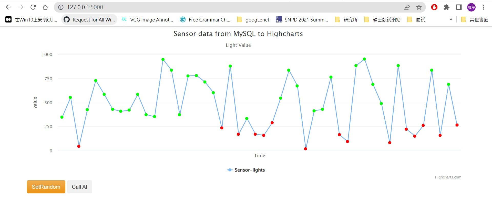
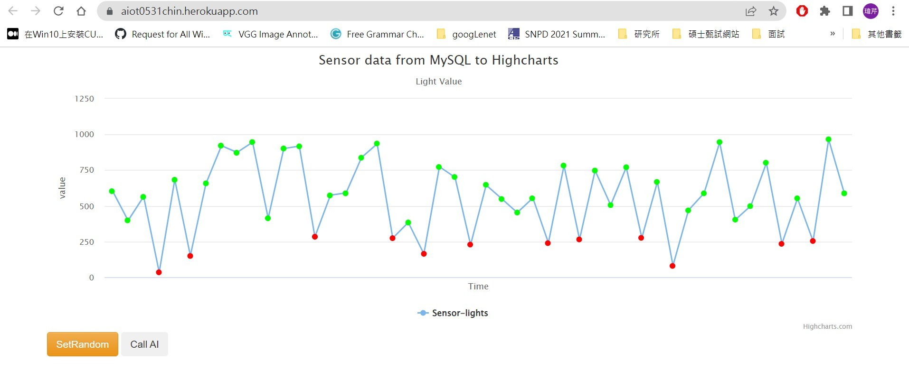
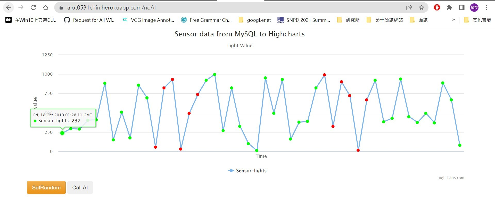
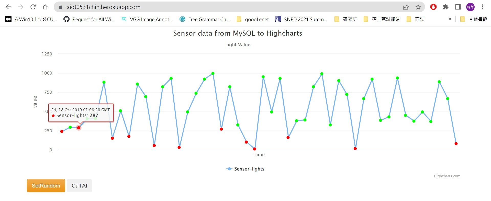

# AIoT Github

## Lecture 15: IoT Flask Web (deploy to heroku)
#### Author: Chin

### step 0 : 
    * 註冊 Heroku, github 請下載 HeidiSQL, VS code 

### step 1 : Clone this github
    * git clone https://github.com/huanchen1107/aiot0530-start-no-token 到 local\aiot0531 folder
    * 把local的 \aiot0531\.git 殺掉 (產生自己的git管理員) 方便建立新的git repository
    * 可把aiot0530-start-no-token裡的東西移進aiot0531，並把aiot0530-start-no-token資料夾刪除
    * 推送至github建立新的https://github.com/LWChin/aiot0531

### step 2 : install some package


```python
pip install gunicorn Flask==2.0.1 Jinja2==3.0.1 psycopg2 sklearn pandas numpy 
```

### step 3: add an heroku postgredb

* register heroku account
* go to dashboard
* new an app
* go to resource and add-on an Heroku postgredb

### step 4: login to heroku pstgredb using HeidiSQL


```sql
myserver ="<fill-in-Heroku-Postgredb-DB-sever>"
myuser="<fill-in-Heroku-Postgredb-DB-user>"
mypassword="<fill-in-Heroku-Postgredb-DB-pwd>"
mydb="<fill-in-Heroku-Postgredb-DB-db>"

```
### step 5: import postgredb (in db/postgre.db)
* 在HeidiSQL，檔案->載入postgre.db->執行

### step 6: setting db in app.py


```sql
myserver ="<fill-in-Heroku-Postgredb-DB-sever>"
myuser="<fill-in-Heroku-Postgredb-DB-user>"
mypassword="<fill-in-Heroku-Postgredb-DB-pwd>"
mydb="<fill-in-Heroku-Postgredb-DB-db>"

```
### step 7: testing locally by running python app.py

### step 8: deploy to github (new public github repositoy)

delete .git and git remote add origin master github.com/xxxxx


### step 9: Heroku deploy from github
* 因為會連接到雲端資料庫，所以跑圖的時候要一些時間
* 在VS code插入圖片的方法：先把圖片放進local資料夾裡，接著把圖片拉進readme，按下shift，放到想插入的位置。[]內可以輸入想叫的名字

### step 10: Complete

Sample link 1:
https://awinlab-aiot.herokuapp.com/

Sample link 2: 
https://aiot0529.herokuapp.com/

My result:
* 一開始成功畫出圖：

* 按下SetRandom：

* 按下callAI：



